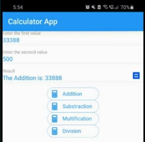

# SmartCalculator

A SmartCalculator é uma calculadora avançada, com capacidade de realizar, além de operações básicas, operações na área de Cálculo como integrais, derivadas e transformadas. 

## Equipe
Gabriel de Seixas Matz - 21404
Nathan Rodrigues Mendes de Souza - 21419
## Motivação
Nosso trabalho visa auxiliar estudantes de diversas áreas a facilitar e agilizar o estudo da matemática universitária.
## Função
O aplicativo será capaz de:

1- Realizar operações numéricas básicas(soma, subtração...);

2- Realizar operações numéricas avançadas(logaritmo, exponencial...);

3- Calcular integrais e derivadas de forma numérica;

4- Calcular integrais e derivadas de forma simbólica;

5- Calcular as principais transformadas(Fourier, Laplace...);

6- Exibir os resultados de forma tabelada em interface gráfica.
## Tutorial
Por padrão, na abertura do aplicativo, uma calculadora comum será mostrada na tela. No canto superior esquerdo da tela haverá um botão que mostra os diferentes tipos de calculadoras presentes no programa, entre elas uma calculadora científica, uma calculadora de programador e uma calculadora que suporta operações de integral, derivada, transformações etc. 

O programa será feito com Python utilizando Kivy.

Imagem de exemplo:

